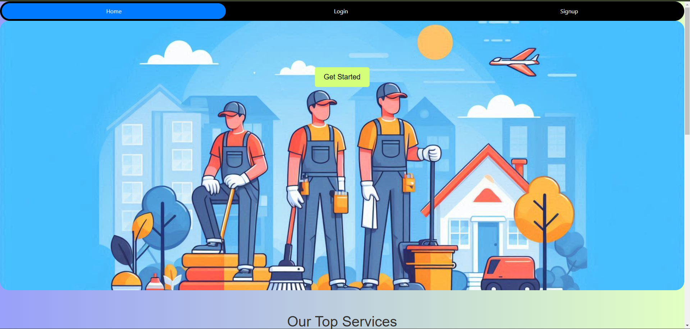
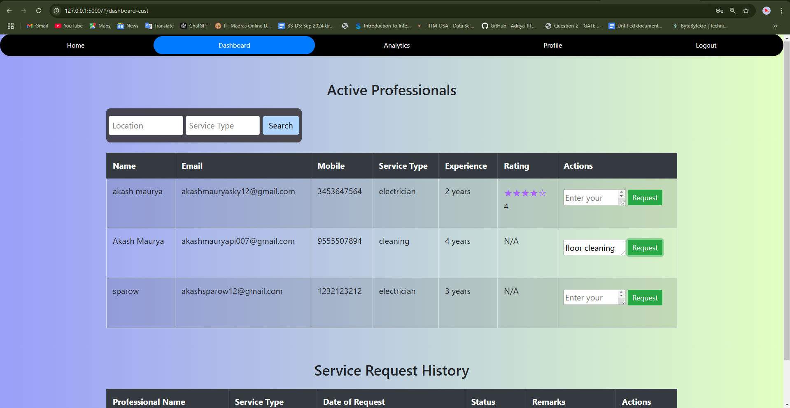
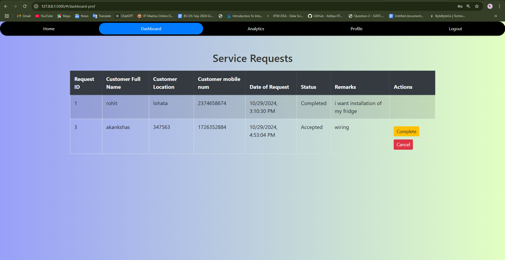
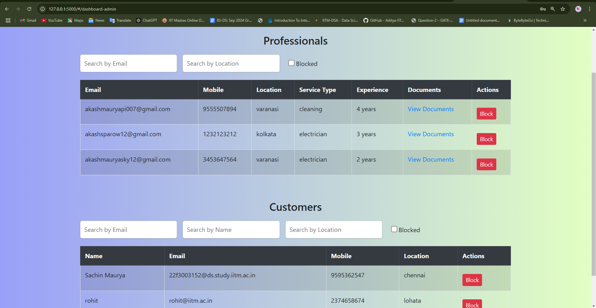
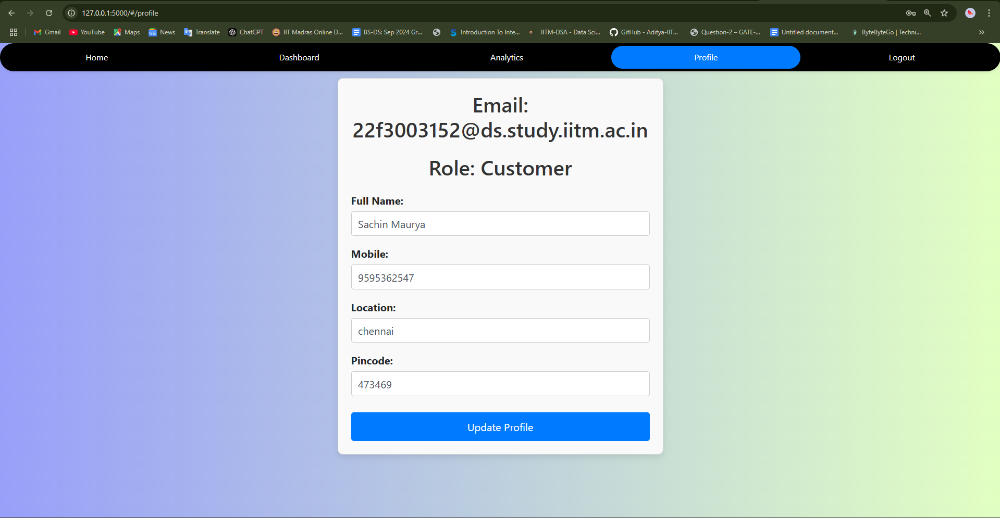
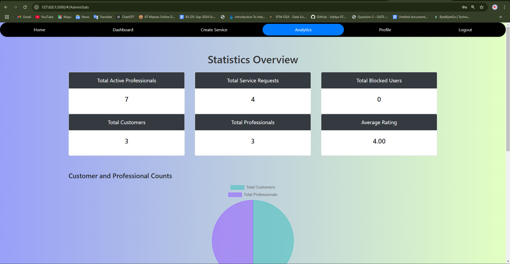
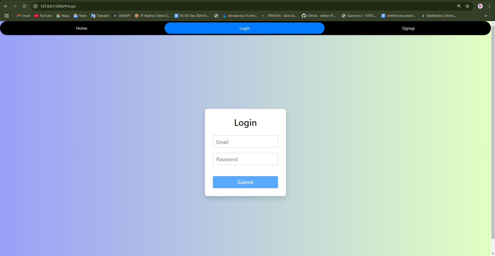
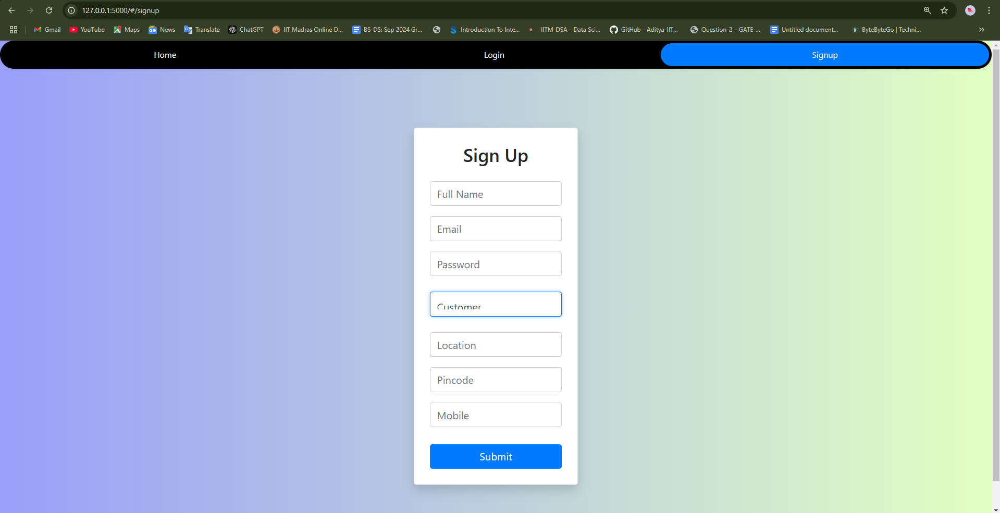
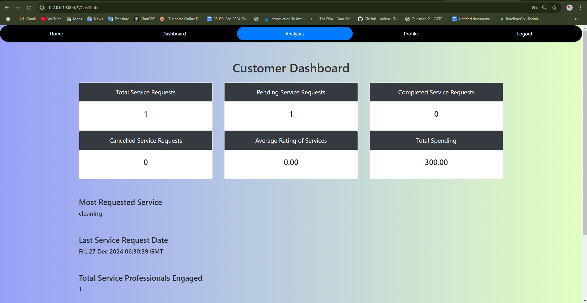
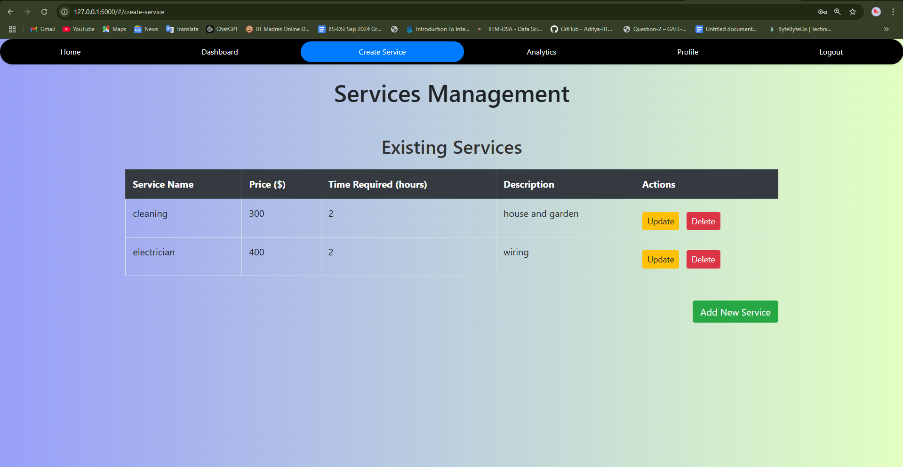

# Household-servicing-app
A web application for managing household services with role-based access for Admin, Professionals, and Customers.

## Features
- Role-based login for Admin, Professionals, and Customers.
- Easy management of household services.
- Dynamic dashboards tailored for each user role.

## Installation
1. **Clone the Repository**  
   Clone this repository to your local machine:
   ```bash
   git clone https://github.com/Akashsky13/Household-servicing-app.git

## nevigate to the main folder
- cd Household_servicing_app
  
## install these requirements 
- pip install -r req.txt
  
## run the app 

- python app.py

## Home


## Customer Page


## Professional Page


## Admin Dashboard


## Profile Page


## Admin Statistics


## Login Page


## Signup Page


## Statistics Page


## Add New Service

